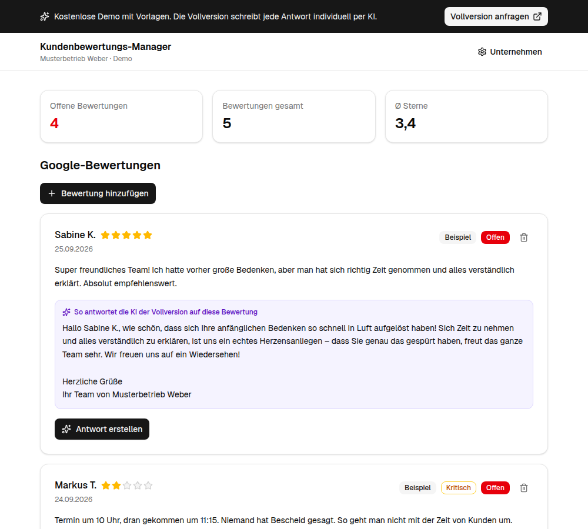

# Kundenbewertungs-Manager – Demo

**Antworten auf Google-Bewertungen in Sekunden – kostenlos zum Ausprobieren.**

Lokale Unternehmen (Arztpraxen, Autohäuser, Restaurants, Handwerk …) leben von
Google-Bewertungen. Unbeantwortete oder gereizte Antworten auf Kritik schrecken Neukunden ab.
Diese Demo zeigt, wie der Kundenbewertungs-Manager dabei hilft:

- ⭐ Bewertungen sammeln und im Blick behalten (offen / beantwortet, Ø Sterne)
- ✍️ Antwortentwurf per Klick erstellen, anpassen, kopieren, bei Google einfügen
- 🛡️ Kritische Bewertungen (1–3 ★) deeskalierend beantworten – mit Bitte um direkten Kontakt
- 🚩 Bei Fake-Verdacht einen Meldetext für Google erstellen

> **Das ist die kostenlose Demo.** Sie arbeitet mit Textvorlagen, läuft komplett lokal in deinem
> Browser und speichert nichts auf einem Server.
>
> **Die Vollversion** schreibt jede Antwort individuell per KI, geht auf den Inhalt jeder
> Bewertung ein, prüft Fake-Verdachtsfälle nach den Google-Richtlinien und läuft online mit
> eigenem Login. Die automatische Anbindung an Google (Bewertungen abrufen und Antworten direkt
> veröffentlichen) ist in Vorbereitung.
>
> 👉 **Interesse an der Vollversion?** Melde dich über mein GitHub-Profil:
> [github.com/Guenbay](https://github.com/Guenbay)



## Demo starten

Voraussetzung: [Node.js](https://nodejs.org) ab Version 20.

```bash
git clone https://github.com/Guenbay/Kundenbewertungs-Manager-Demo.git
cd Kundenbewertungs-Manager-Demo
npm install
npm run dev
```

Dann im Browser **http://localhost:3000** öffnen.

Optional als statische Seite bauen (z. B. zum Hochladen auf einen beliebigen Webspace):

```bash
npm run build   # Ergebnis im Ordner out/
```

## Datenschutz

Alle Eingaben (Bewertungen, Unternehmensdaten) werden ausschließlich im `localStorage` deines
Browsers gespeichert. Es gibt keinen Server, keine Datenbank, kein Tracking.
„Demo zurücksetzen“ unten auf der Seite löscht alles.

## Anpassen

Den Link hinter „Vollversion anfragen“ kannst du über eine Datei `.env.local` ändern
(Vorlage: `.env.example`).

## Technik

Next.js 16 · React 19 · TypeScript · Tailwind CSS 4 · shadcn/ui

## Lizenz

MIT – siehe [LICENSE](./LICENSE). Die Vollversion ist nicht Teil dieses Repositorys.
