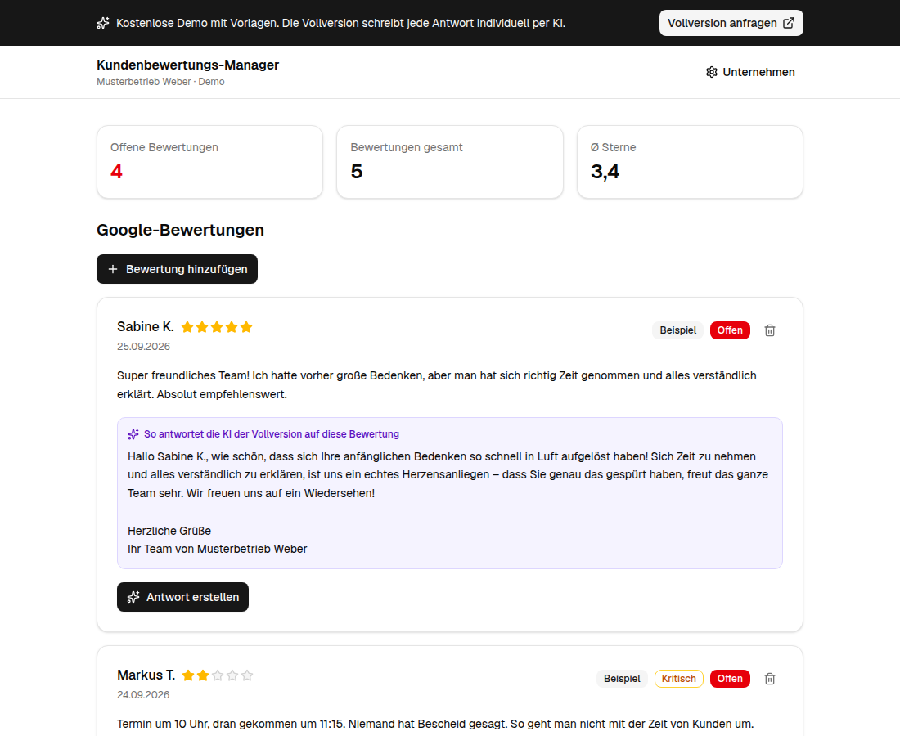
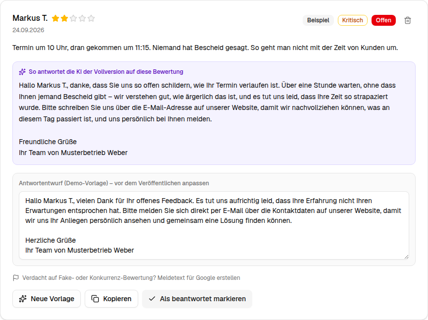
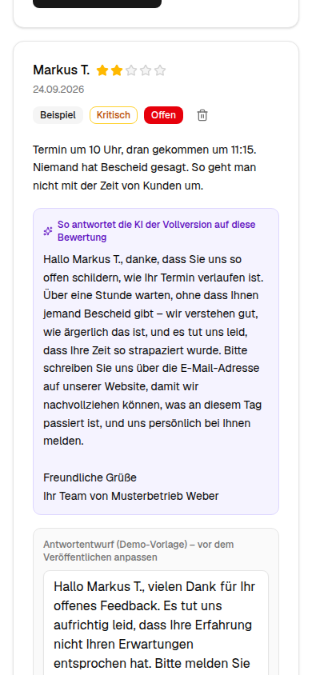

# Kundenbewertungs-Manager – Demo

**Antworten auf Google-Bewertungen in Sekunden – kostenlos zum Ausprobieren.**

[](https://guenbay.github.io/Kundenbewertungs-Manager-Demo/)
[](./LICENSE)
[](https://nodejs.org)

Lokale Unternehmen (Arztpraxen, Autohäuser, Restaurants, Handwerk …) leben von
Google-Bewertungen. Unbeantwortete oder gereizte Antworten auf Kritik schrecken Neukunden ab.
Diese Demo zeigt, wie der Kundenbewertungs-Manager dabei hilft:

- ⭐ Bewertungen sammeln und im Blick behalten (offen / beantwortet, Ø Sterne)
- ✍️ Antwortentwurf per Klick erstellen, anpassen, kopieren, bei Google einfügen
- 🛡️ Kritische Bewertungen (1–3 ★) deeskalierend beantworten – mit Bitte um direkten Kontakt
- 🚩 Bei Fake-Verdacht einen Meldetext für Google erstellen

> **Das ist die kostenlose Demo.** Sie arbeitet mit Textvorlagen, läuft komplett lokal in deinem
> Browser und speichert nichts auf einem Server.
>
> **Die Vollversion** schreibt jede Antwort individuell per KI, geht auf den Inhalt jeder
> Bewertung ein, prüft Fake-Verdachtsfälle nach den Google-Richtlinien und läuft online mit
> eigenem Login. Die automatische Anbindung an Google (Bewertungen abrufen und Antworten direkt
> veröffentlichen) ist in Vorbereitung.
>
> 👉 **Interesse an der Vollversion?** [Formular öffnen](https://github.com/Guenbay/Kundenbewertungs-Manager-Demo/issues/new?template=vollversion-anfragen.yml)
> (kurzes GitHub-Formular, keine Anmeldung nötig – oder direkt über den Button in der Demo).



## Demo ausprobieren

**Ohne Installation:** Direkt im Browser öffnen –
**[guenbay.github.io/Kundenbewertungs-Manager-Demo](https://guenbay.github.io/Kundenbewertungs-Manager-Demo/)**

**Lokal auf dem eigenen Rechner** (Voraussetzung: [Node.js](https://nodejs.org/de) ab Version 20):

```bash
git clone https://github.com/Guenbay/Kundenbewertungs-Manager-Demo.git
cd Kundenbewertungs-Manager-Demo
npm install
npm run dev
```

Danach im Browser [http://localhost:3000](http://localhost:3000) öffnen.

Optional als statische Seite bauen (z. B. zum Hochladen auf einen beliebigen Webspace):

```bash
npm run build   # Ergebnis im Ordner out/
```

## So sieht's aus

| Antwortentwurf bearbeiten | Auf dem Smartphone |
| --- | --- |
|  |  |

## Datenschutz

Alle Eingaben (Bewertungen, Unternehmensdaten) werden ausschließlich im `localStorage` deines
Browsers gespeichert. Es gibt keinen Server, keine Datenbank, kein Tracking.
„Demo zurücksetzen“ unten auf der Seite löscht alles.

## Anpassen

Den Link hinter „Vollversion anfragen“ kannst du über eine Datei `.env.local` ändern
(Vorlage: [.env.example](./.env.example)).

## Weiterführende Links

- 📖 [Node.js herunterladen](https://nodejs.org/de) (Voraussetzung für die lokale Nutzung)
- 💬 [Vollversion anfragen](https://github.com/Guenbay/Kundenbewertungs-Manager-Demo/issues/new?template=vollversion-anfragen.yml) (GitHub-Formular)
- 🐞 [Fehler melden / Frage stellen](https://github.com/Guenbay/Kundenbewertungs-Manager-Demo/issues/new/choose)
- 📄 [Lizenz (MIT)](./LICENSE)

## Technik

Next.js 16 · React 19 · TypeScript · Tailwind CSS 4 · shadcn/ui. Statischer Export, gehostet auf
GitHub Pages (siehe [.github/workflows/deploy-pages.yml](./.github/workflows/deploy-pages.yml)).

## Lizenz

MIT – siehe [LICENSE](./LICENSE). Die Vollversion ist nicht Teil dieses Repositorys.
